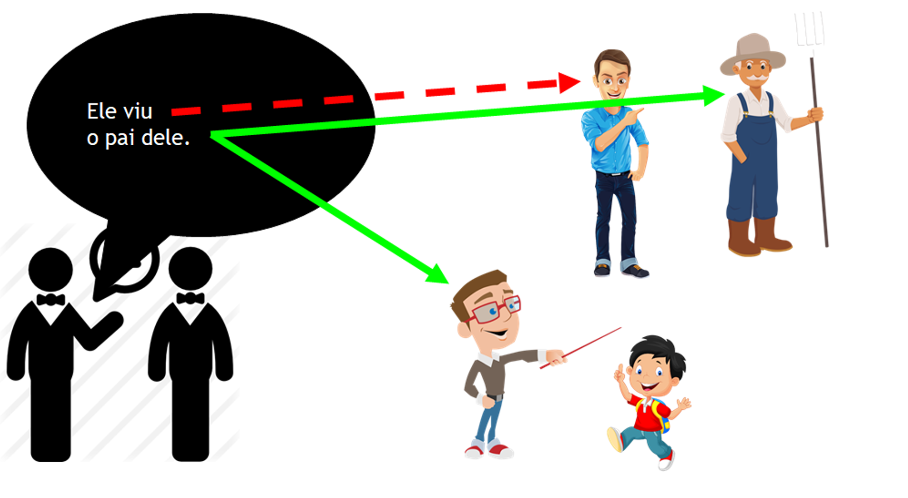
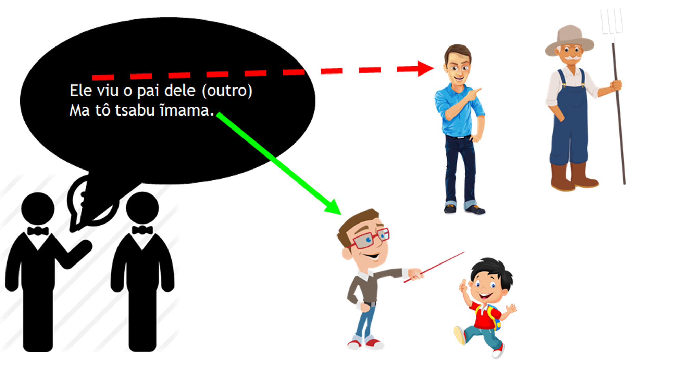
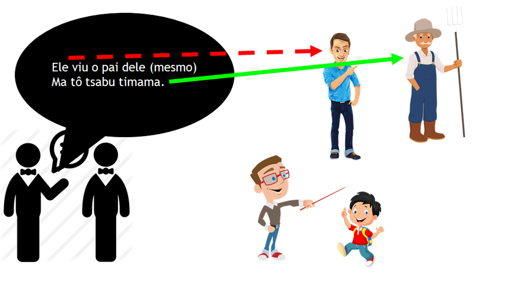

# Posse Inalienável ou Cultural

Coisas que não mudam de dono, que *não podem ser vendidas ou trocadas:*

- pai (meu pai, teu pai, pai dele, etc)
- mãe
- corpo (meu corpo, teu corpo)

## Conjugação

```text
  Singular:
  1º (meu)            ĩ̱[posse]
  2º (teu)         a/ai[posse]
  3º (dele)           ĩ[posse]
  3º (dele próprio)  ti[posse]

  Dual:
  1º (nosso)         wa[posse]
  2º (teu)         a/ai[posse] ˈwa / waˈwa
  3º (dele)           ĩ[posse] dzahuré
  3º (dele próprio)  ti[posse] dzahuré

  Plural:
  1º (nosso)         wa[posse] dzaˈra
  2º (teu)         a/ai[posse] dzaˈra waˈwa
  3º (dele)           ĩ[posse] dzaˈra
  3º (dele mesmo)    ti[posse] dzaˈra

  Especiais:
  genérico (de uma pessoa)   da[posse]  (objeto singular)
  de alguém      [substantivo] [posse]  (3º pessoa com substantivo)
```

## Exemplos

- `damama` pai da pessoa
- `ĩ̱mama` meu pai
- `aimama` teu pai
- `ĩmama` pai dele
- `timama` pai dele próprio
- `wamama` pai de nós 2 (coloquialmente pai de nós todos)
- `wamama dzaꞌra` pai de nós todos
- `dahöiba` corpo da pessoa
- `ĩ̱höiba` meu corpo
- `aihöiba` teu corpo
- `e niha te aihöiba` com você está?
- `e niha aihöiba` Como é teu corpo?
- `ĩhöiba` corpo dele
- `wahöiba` nosso corpo
- `daꞌra` filho de alguém
- `ĩ̱ꞌra` meu filho
- `aiꞌra` teu filho
- `ĩꞌra` filho dele
- `tiꞌra` o próprio filho dele
- `dadiꞌi` barriga da pessoa
- `ĩ̱di` minha barriga
- `dapara` pé da pessoa
- `ĩ̱para` meu pé
- `dahöimanadzé` vida
- `ĩ̱höimanadzé` minha vida
- `aihöimanadzé` tua vida
- `ĩhöimanadzé` vida dele
- `wahöimanadzé` nossa vida (dual / coloquial para todos)
- `wahöimanadzé dzaꞌra` nossa vida (todos)
- `Jesus höimanadzé` vida de Jesus  
- `dahiꞌrada` antepassado
- `Jesus hiꞌrada` Antepassado de Jesus
- `ĩhiꞌrada` Antepassado dele
- `damro` cônjuge
- `ĩ̱mro` meu cônjuge (esposa/marido)
- `aimro` teu cônjuge (esposa/marido)
- `ĩmro` cônjuge dele (esposa/marido)
- `timro` cônjuge dele mesmo (esposa/marido)

### Alguns sofrem mudança de *nhi* para *tsi*

- `danhihudu` descendentes
- `ĩ̱nhihudu`  meu descendente
- `atsihudu`  teu descendente
- `ĩtsihudu`  descendente dele
- `wanhihudu`  nosso descendente
- `atsihudu dzaꞌra`  descendente de vocês (todos)
- `Adão nhihudu` descendente de adão
- `danhihödö`  escrita
- `danhibdzari` donativo, presente  
- `ĩ̱nhibdzari` meu donativo  
- `atsibdzari` teu donativo  
- `Wa tô titsõ ĩ̱nhibdzari` Eu dei meu donativo
- `danhibꞌaꞌuwẽ` povo
- `ĩ̱nhibꞌaꞌuwẽ` meu povo  
- `atsibꞌaꞌuwẽ` teu povo  
- `ĩtsibꞌaꞌuwẽ` povo dele  

### Outros sofrem mudança de *nho* para *tsõ*

- `danho'reptui'wa` salvador
- `ĩ̱nho'reptui'wa` meu salvador
- `atsõ'reptui'wa` teu salvador
- `ĩtsõꞌreptuiꞌwa` salvador dele
- `wanhoꞌreptuiꞌwa` nosso salvador
- `danho'reptudzé` salvação
- `danho're` pescoço, cântico, canto
- `wanhoꞌre` nosso cântico
- `atsõꞌre` teu cântico
- `Danhorõwa` casa xavante de alguém
- `ĩ̱nhorõwa` ⇒ minha casa
- `atsõrõwa` tua casa (a casa de você)  
- `ĩtsõrõwa` a casa dele
- `tinhorõwa` ⇒ a casa dele mesmo
- `wanhorõwa` ⇒ nossa casa (a casa de nós dois)
- `atsõrõwa ꞌwa` ⇒ a casa de vocês dois
- `ĩtsõrõwa dzahuré` ⇒ a casa deles dois
- `tinhorõwa dzahuré` ⇒ a casa deles dois mesmos
- `wanhorõwa dzaꞌra` ⇒ nossa casa (a casa de nós 3 ou mais)
- `atsõrõwa dzaꞌra waꞌwa` ⇒ a casa de vocês (3 ou mais)
- `ĩtsõrõwa dzaꞌra` ⇒ a casa deles (3 ou mais)
- `tinhorõwa dzaꞌra` ⇒ a casa deles mesmos (3 ou mais)
- `Tsere nhorõwa` ⇒ a casa do Tsere

> Note que alguns objetos, como casa, são conjugados como uma posse inalienável, embora possam passar para outros donos. Uma explicação para isso seria que a casa xavante faz parte da cultura e por isso segue a mesma forma de conjugação das posses que não mudam de dono.

## Prefixo *ti* com posses

Indica dele próprio, dele mesmo. É usada nas frases onde a ação é realizada na própria posse do ator (sujeito) da oração. Sempre será um objeto da ação, nunca será o sujeito (ator principal) da oração.

Por exemplo:

- `te romhu timama ma` ele trabalha para o pai dele (o pai dele mesmo)
- `te romhu ĩmama ma` ele trabalha para o pai dele (o pai de outra pessoa)

O xavante é mais específico que o português. Em xavante é obrigatório ser específico, indicando exatamente de quem está falando. No português essa frase é ambígua, pois dá margem para entender de duas maneiras. Nas figuras abaixo duas pessoas estão conversando sobre o que outra pessoa viu.


Ele viu o pai dele mesmo?! Ou seria o pai de outra pessoa?!


`ĩmama` o pai de dele (outra pessoa), não é posse do ator principal (sujeito) da oração.


`timama` o pai dele mesmo, o pai da pessoa de quem estamos falando, é posse do sujeito (ator) da oração.
