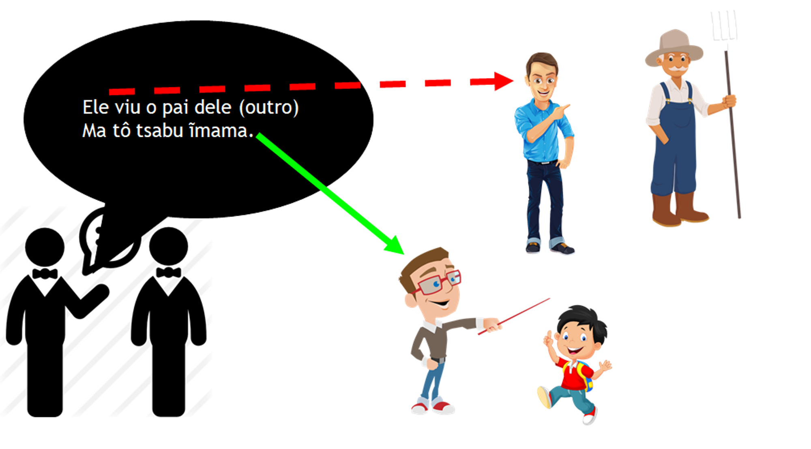
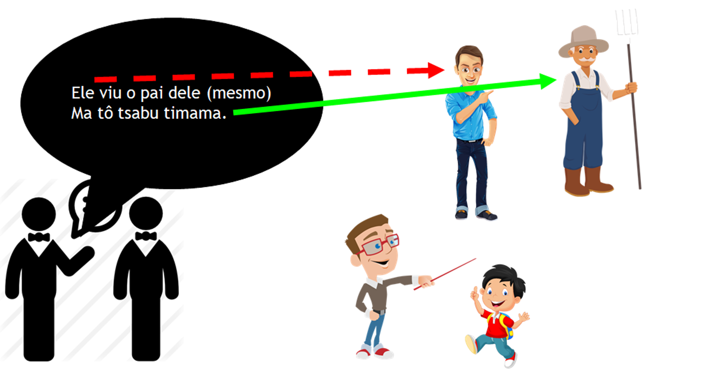

# Posse intransferível ou Cultural

A posse intransferível, ou cultural, é a forma de se referir a objetos ou coisas que fazem parte de uma pessoa ou família e que não podem ser vendidas, trocadas ou transferidas para outra pessoa. São coisas que fazem parte da identidade ou da família e que não podem ser separadas delas. Exemplos de coisas que são consideradas posse intransferível incluem:

- pai (meu pai, teu pai, pai dele, etc)
- mãe
- corpo (meu corpo, teu corpo)

Essas coisas são consideradas inalienáveis porque não podem ser separadas de quem as possuem. Elas fazem parte da identidade e da família de quem as possuem e não podem ser transferidas para outra pessoa. Por exemplo, um pai não pode vender ou transferir seu pai para outra pessoa, pois o pai faz parte da família e da identidade da pessoa. Da mesma forma, uma pessoa não pode vender ou transferir seu corpo para outra pessoa, pois o corpo faz parte da identidade e da individualidade da pessoa.

Essa forma de posse é importante para se compreender a cultura e a linguagem xavante, pois reflete a forma como a sociedade xavante se organiza e se relaciona com as coisas e com as pessoas. Além disso, a posse intransferível é uma forma de se expressar a identidade e a família em xavante, e de se mostrar respeito e consideração pelas coisas e pelas pessoas que fazem parte da vida de uma pessoa.

## Conjugação

```text
  Singular:
  1º (meu)            ĩ̱[posse]
  2º (teu)         a/ai[posse]
  3º (dele)           ĩ[posse]
  3º (dele próprio)  ti[posse]

  Dual:
  1º (nosso)         wa[posse]
  2º (teu)         a/ai[posse] ˈwa / waˈwa
  3º (dele)           ĩ[posse] dzahuré
  3º (dele próprio)  ti[posse] dzahuré

  Plural:
  1º (nosso)         wa[posse] dzaˈra
  2º (teu)         a/ai[posse] dzaˈra waˈwa
  3º (dele)           ĩ[posse] dzaˈra
  3º (dele mesmo)    ti[posse] dzaˈra

  Especiais:
  genérico (de uma pessoa)   da[posse]  (objeto singular)
  de alguém      [substantivo] [posse]  (3º pessoa com substantivo)
```

## Exemplos

- `damama` pai da pessoa
- `ĩ̱mama` meu pai
- `aimama` teu pai
- `ĩmama` pai dele
- `timama` pai dele próprio
- `wamama` pai de nós 2 (coloquialmente pai de nós todos)
- `wamama dzaꞌra` pai de nós todos
- `dahöiba` corpo da pessoa
- `ĩ̱höiba` meu corpo
- `aihöiba` teu corpo
- `e niha te aihöiba` com você está?
- `e niha aihöiba` Como é teu corpo?
- `ĩhöiba` corpo dele
- `wahöiba` nosso corpo
- `daꞌra` filho de alguém
- `ĩ̱ꞌra` meu filho
- `aiꞌra` teu filho
- `ĩꞌra` filho dele
- `tiꞌra` o próprio filho dele
- `dadiꞌi` barriga da pessoa
- `ĩ̱di` minha barriga
- `dapara` pé da pessoa
- `ĩ̱para` meu pé
- `dahöimanadzé` vida
- `ĩ̱höimanadzé` minha vida
- `aihöimanadzé` tua vida
- `ĩhöimanadzé` vida dele
- `wahöimanadzé` nossa vida (dual / coloquial para todos)
- `wahöimanadzé dzaꞌra` nossa vida (todos)
- `Jesus höimanadzé` vida de Jesus  
- `dahiꞌrada` antepassado
- `Jesus hiꞌrada` Antepassado de Jesus
- `ĩhiꞌrada` Antepassado dele
- `damro` cônjuge
- `ĩ̱mro` meu cônjuge (esposa/marido)
- `aimro` teu cônjuge (esposa/marido)
- `ĩmro` cônjuge dele (esposa/marido)
- `timro` cônjuge dele mesmo (esposa/marido)

### Alguns sofrem mudança de *nhi* para *tsi*

- `danhihudu` descendentes
- `ĩ̱nhihudu`  meu descendente
- `atsihudu`  teu descendente
- `ĩtsihudu`  descendente dele
- `wanhihudu`  nosso descendente
- `atsihudu dzaꞌra`  descendente de vocês (todos)
- `Adão nhihudu` descendente de adão
- `danhihödö`  escrita
- `danhibdzari` donativo, presente  
- `ĩ̱nhibdzari` meu donativo  
- `atsibdzari` teu donativo  
- `Wa tô titsõ ĩ̱nhibdzari` Eu dei meu donativo
- `danhibꞌaꞌuwẽ` povo
- `ĩ̱nhibꞌaꞌuwẽ` meu povo  
- `atsibꞌaꞌuwẽ` teu povo  
- `ĩtsibꞌaꞌuwẽ` povo dele  

### Outros sofrem mudança de *nho* para *tsõ*

- `danho'reptui'wa` salvador
- `ĩ̱nho'reptui'wa` meu salvador
- `atsõ'reptui'wa` teu salvador
- `ĩtsõꞌreptuiꞌwa` salvador dele
- `wanhoꞌreptuiꞌwa` nosso salvador
- `danho'reptudzé` salvação
- `danho're` pescoço, cântico, canto
- `wanhoꞌre` nosso cântico
- `atsõꞌre` teu cântico
- `Danhorõwa` casa xavante de alguém
- `ĩ̱nhorõwa` ⇒ minha casa
- `atsõrõwa` tua casa (a casa de você)  
- `ĩtsõrõwa` a casa dele
- `tinhorõwa` ⇒ a casa dele mesmo
- `wanhorõwa` ⇒ nossa casa (a casa de nós dois)
- `atsõrõwa ꞌwa` ⇒ a casa de vocês dois
- `ĩtsõrõwa dzahuré` ⇒ a casa deles dois
- `tinhorõwa dzahuré` ⇒ a casa deles dois mesmos
- `wanhorõwa dzaꞌra` ⇒ nossa casa (a casa de nós 3 ou mais)
- `atsõrõwa dzaꞌra waꞌwa` ⇒ a casa de vocês (3 ou mais)
- `ĩtsõrõwa dzaꞌra` ⇒ a casa deles (3 ou mais)
- `tinhorõwa dzaꞌra` ⇒ a casa deles mesmos (3 ou mais)
- `Tsere nhorõwa` ⇒ a casa do Tsere

> Note que alguns objetos, como casa, são conjugados como uma posse intransferível, mesmo que, na prática, possam ser transferidos para outras pessoas. Isso ocorre porque a casa xavante é vista como parte integrante da cultura, e assim, segue a mesma regra de conjugação das posses que são intransferíveis.

## Uso do Prefixo *ti* com Posses

O prefixo *ti* é utilizado para indicar que algo pertence a ele próprio, ou seja, à própria pessoa que realiza a ação. Esse prefixo é aplicado em frases onde a ação é realizada sobre algo que pertence ao sujeito da oração, mas nunca é o sujeito principal da oração.

Por exemplo:

- `te romhu timama ma` significa "ele trabalha para o pai dele mesmo", indicando que o trabalho é feito para o próprio pai do sujeito.
- `te romhu ĩmama ma` significa "ele trabalha para o pai dele", mas neste caso, o pai é de outra pessoa, e não do próprio sujeito.

No idioma xavante, a especificidade é crucial. É obrigatório indicar claramente a quem ou a quê se refere, evitando qualquer ambiguidade. Isso difere do português, onde a mesma frase pode ser interpretada de diferentes maneiras. Por exemplo, nas figuras abaixo, duas pessoas discutem sobre o que alguém viu, e a clareza sobre a identidade de posse é mantida no xavante.


Ele viu o pai dele mesmo?! Ou seria o pai de outra pessoa?!


`ĩmama` o pai de dele (outra pessoa), não é posse do ator principal (sujeito) da oração.


`timama` o pai dele mesmo, o pai da pessoa de quem estamos falando, é posse do sujeito (ator) da oração.
