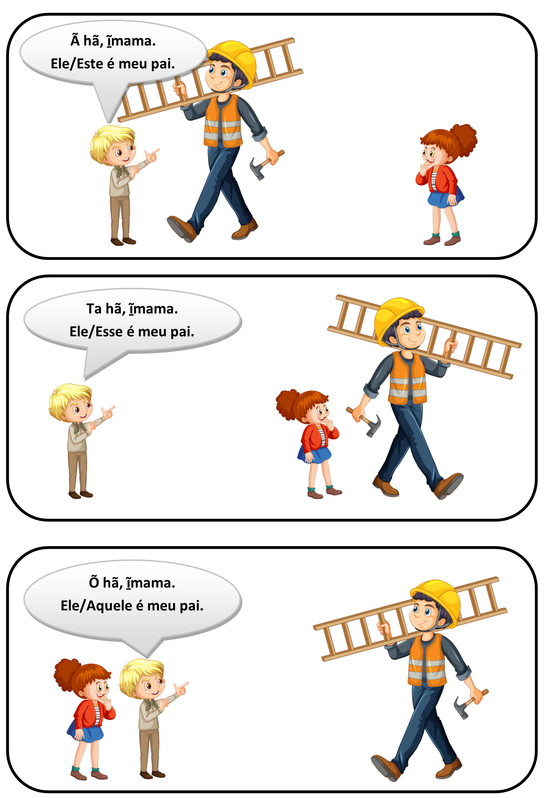

# Pronomes pessoais

## Tabela

|     Pessoas Verbais      |  Pronomes do Caso Reto Português   |      Xavante      |
| :----------------------: | :--------------------------------: | :---------------: |
|  1ª pessoa do singular   |                 eu                 |      `wa hã`      |
|  2ª pessoa do singular   |              tu/você               |      `a hã`       |
|  3ª pessoa do singular   |   ele/ela aqui, este, esta, isto   |      `ã hã`       |
|            ^^            |    ele/ela aí, esse, essa, isso    |      `ta hã`      |
|            ^^            | ele/ela lá, aquele, aquela, aquilo |      `õ hã`       |
| 1ª pessoa do dual/plural |                nós                 |      `wa hã`      |
| 2ª pessoa do dual/plural |                vós                 | `a norĩ waꞌwa hã` |
| 3ª pessoa do dual/plural |    eles/elas aqui, estes, estas    |    `ã norĩ hã`    |
|            ^^            |     eles/elas aí, esses, essas     |   `ta norĩ hã`    |
|            ^^            |   eles/elas lá, aqueles, aquelas   |    `õ norĩ hã`    |

## Distâncias na 3º pessoa

- perto de quem fala, mas longe de quem escuta
  - ele aqui, este `ã hã`
  - eles aqui, estes `ã norĩ hã`
- longe de quem fala, mas perto de quem escuta
  - ele aí, esse `ta hã`
  - eles aí, esses `ta norĩ hã`
- longe de quem fala e também longe de quem escuta
  - ele lá, aquele `õ hã`
  - eles lá, aqueles `õ norĩ hã`

 Créditos das imagens: <a href="https://br.freepik.com/vetores-gratis/uma-garota-com-personagem-de-desenho-animado-de-cabelo-vermelho_37409169.htm#query=desenho%20crian%C3%A7a%20olhando&position=1&from_view=search&track=ais">menina</a>, <a href="https://br.freepik.com/vetores-gratis/um-trabalhador-da-construcao-civil-segurando-a-escada_25667794.htm#query=desenho%20pedreiro&position=10&from_view=search&track=ais">menino</a> e <a href="https://br.freepik.com/vetores-gratis/menino-em-uniforme-de-escoteiro-apontando-em-branco_6829991.htm#query=desenho%20crian%C3%A7a%20apontando&position=4&from_view=search&track=ais">adulto </a> de brgfx no Freepik 
